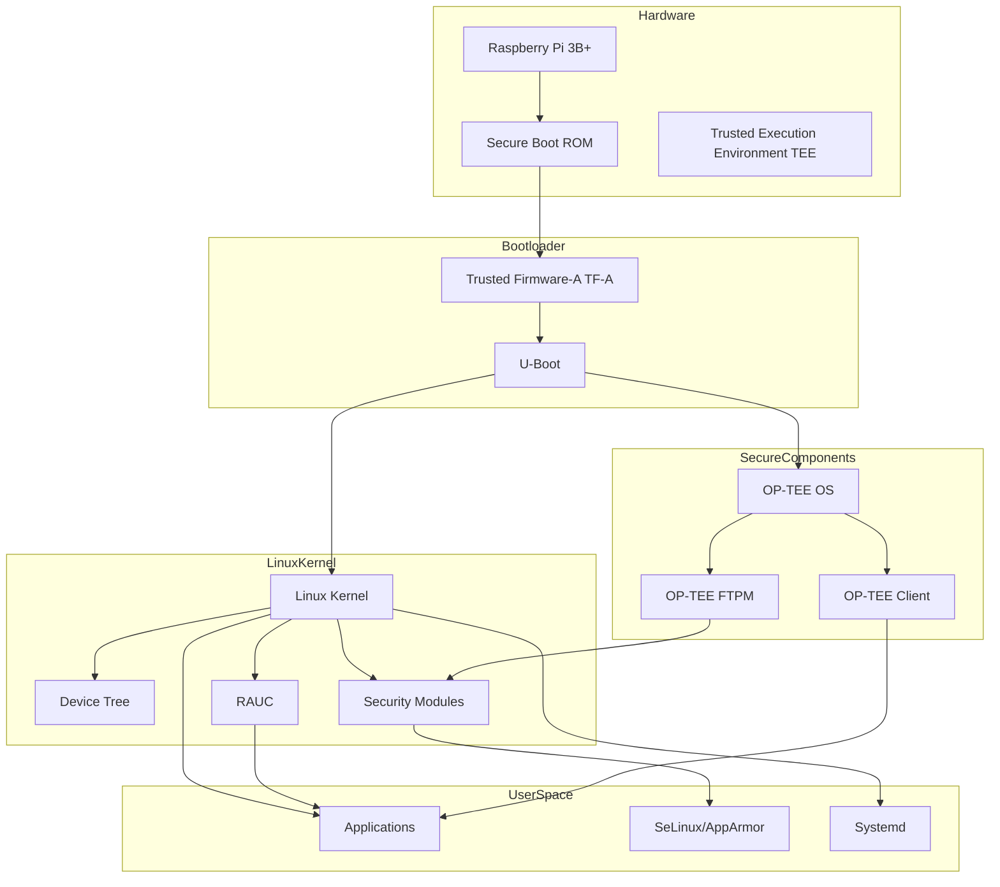
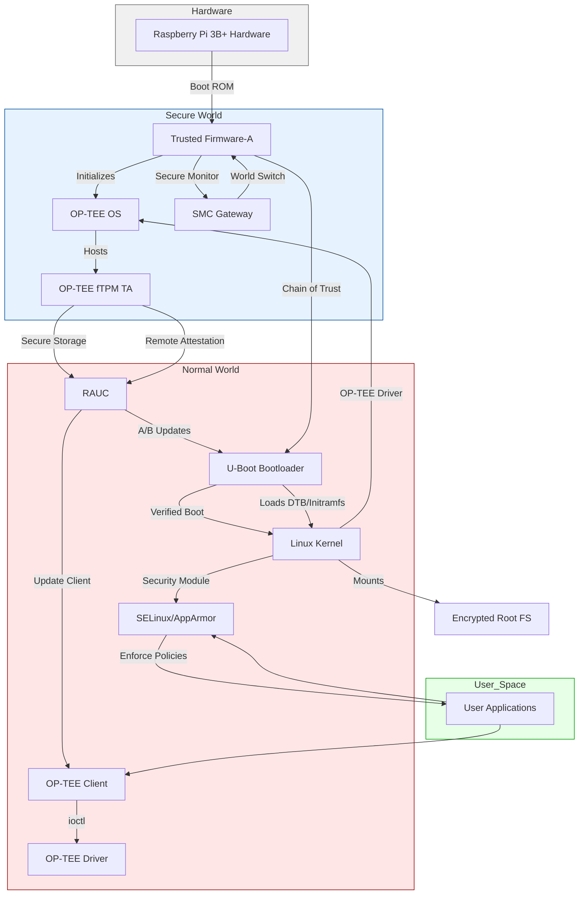

<!--
While building a secure embedded linux system for a Raspberry PI 3B+ board, I need to leverage 
Linux kernel, Uboot,optee_os, optee_ftpm,optee_client,trusted-firmware-a,rauc,SeLinux/AppArmor. 
Kindly generage a High-Level Architecture of the system using mermaid syntax. Kindly consider all cases you may find suitable foe the system
-->
### QW 2.5 Max


### R1 Nvidia

Okay, let's tackle this problem. The user wants a high-level architecture diagram using Mermaid syntax for a secure embedded Linux system on a Raspberry Pi 3B+. 
They mentioned several components: Linux kernel, U-Boot, OP-TEE OS, OP-TEE fTPM, OP-TEE client, Trusted Firmware-A, RAUC, and SELinux/AppArmor.


First, I need to recall what each of these components does and how they fit together. Let me start by listing each component and their roles.


Trusted Firmware-A (TF-A): This is the ARM Trusted Firmware, which provides a reference implementation of secure world software. 
It's responsible for initializing the secure environment, handling secure monitor calls, and setting up the transition between the secure and non-secure states. 
For Raspberry Pi, which uses an ARM processor, TF-A would be the first thing that runs, initializing the hardware and setting up the boot process.

U-Boot: This is the bootloader. It's responsible for loading the Linux kernel and the device tree. In a secure boot scenario, U-Boot might also verify the kernel's signature before loading it. 
Since the user mentioned secure boot, I should consider how U-Boot interacts with TF-A and the secure components.

OP-TEE OS: OP-TEE (Open Portable Trusted Execution Environment) is a trusted execution environment for ARM devices. It runs in the secure world, isolated from the normal world (where Linux runs). 
It provides secure services to applications through the TEE client API. OP-TEE OS would handle secure operations like cryptography, key storage, etc.

OP-TEE fTPM: This is a firmware-based Trusted Platform Module implementation using OP-TEE. A TPM is used for secure storage of cryptographic keys, attestation, and other security functions. 
The fTPM would run in the secure world, providing TPM services to the normal world via OP-TEE.

OP-TEE Client: This is the client component in the normal world that communicates with the OP-TEE OS. It provides a way for user-space applications to send requests to the trusted applications running in the secure world. 
So, applications in Linux would use the OP-TEE client library to talk to the fTPM or other trusted apps.

Linux Kernel: The main OS kernel. It needs to be configured with support for OP-TEE, SELinux/AppArmor, and other security modules. 
The kernel runs in the non-secure world and interacts with the secure world via SMC (Secure Monitor Call) instructions, which are handled by TF-A and OP-TEE.

RAUC: This is a robust update framework for embedded systems. It handles secure firmware and software updates. RAUC would need to ensure that updates are signed and verified before applying them. 
It might interact with the fTPM for secure boot measurements or to check the system's integrity before updating.

SELinux/AppArmor: These are Linux Security Modules (LSM) that enforce mandatory access control (MAC). SELinux or AppArmor policies would restrict what processes can do, adding another layer of security. 
The choice between SELinux and AppArmor might depend on the user's preference, but the architecture should account for either.

Now, considering the boot process. The Raspberry Pi 3B+ uses a Broadcom SoC, which is ARM-based. The typical boot flow for ARM systems with TF-A and U-Boot would be:


Boot ROM (on the SoC) loads TF-A.
TF-A initializes the secure world, sets up the secure monitor, then hands off to U-Boot in the non-secure world.
U-Boot loads the Linux kernel, device tree, and initramfs (if used). U-Boot might verify the kernel's signature using keys stored in secure storage (possibly via OP-TEE or fTPM).
The Linux kernel starts, initializes hardware, and mounts the root filesystem. During boot, the kernel can interface with OP-TEE via the OP-TEE driver, which uses SMC to communicate with OP-TEE OS.
Once the system is up, user-space applications (like RAUC) can use the OP-TEE client to communicate with trusted applications (like fTPM) in the secure world.

For security, the chain of trust should start from the Boot ROM (which is immutable), then TF-A, then U-Boot, then the Linux kernel, and so on. Each stage verifies the next component before executing it.


RAUC's role would come into play when updating the system. It would need to verify update bundles using cryptographic signatures, possibly leveraging the fTPM for secure storage of keys or for measurements as part of the Trusted Computing Group's specifications.


SELinux or AppArmor would enforce policies on processes. For example, confining services to least privilege, preventing unauthorized access to resources.


Now, structuring this into a Mermaid diagram. The main components and their interactions:


Secure World: Contains TF-A, OP-TEE OS, and OP-TEE fTPM.
Normal World: Contains U-Boot, Linux Kernel, OP-TEE Client, RAUC, and SELinux/AppArmor.

The Boot ROM isn't included in the diagram since it's part of the hardware, but TF-A is the first software component.


Interactions:


TF-A is the foundation, initializing the secure environment and handling SMC.
U-Boot runs after TF-A, loading the kernel.
The Linux kernel uses OP-TEE driver to communicate with OP-TEE OS.
OP-TEE Client in user-space communicates with OP-TEE OS via the driver.
OP-TEE fTPM is a TA (Trusted Application) within OP-TEE OS.
RAUC interacts with the fTPM for secure updates and possibly with U-Boot for boot control (like A/B updates).
SELinux/AppArmor are integrated into the kernel, enforcing policies.

Potential security considerations to include in the diagram:


Secure Boot Chain: Each component verifies the next.
Secure Storage: fTPM provides secure storage for keys.
Secure Updates: RAUC uses cryptographic verification, possibly with keys stored in fTPM.
Mandatory Access Control: SELinux/AppArmor policies restrict process capabilities.

Possible attack vectors and how the architecture mitigates them:


Unauthorized firmware updates: Mitigated by RAUC's signature verification and secure boot.
Kernel exploits: Mitigated by SELinux/AppArmor restricting post-exploit actions.
Secure world breaches: OP-TEE OS is isolated, and TF-A ensures secure/non-secure separation.

Now, putting this into Mermaid syntax. The diagram should show layers from hardware up to applications, with secure and normal worlds separated.


I'll structure it with the following sections:


Hardware Layer (Raspberry Pi 3B+)
Secure World Components (TF-A, OP-TEE OS, fTPM)
Normal World Components (U-Boot, Linux Kernel, OP-TEE Client, RAUC, SELinux/AppArmor)
User Space Applications

Connections:


TF-A is at the lowest software level, interfacing with hardware.
U-Boot is loaded by TF-A.
Linux Kernel is loaded by U-Boot.
OP-TEE OS runs in secure world, interfacing with TF-A.
Linux Kernel communicates with OP-TEE OS via SMC (through OP-TEE driver).
OP-TEE Client in user space communicates with OP-TEE OS via the driver.
fTPM is a TA within OP-TEE OS.
RAUC uses OP-TEE Client/fTPM for secure updates.
SELinux/AppArmor are part of the kernel's security modules.

Including notes for security features like Secure Boot, Trusted Applications, etc., as annotations.


I should also consider the boot sequence arrows, but maybe in a separate subgraph. Alternatively, use different sections to group components.


Wait, Mermaid's syntax allows for subgraphs, which can represent the secure and normal worlds. So:

```mermaid
subgraph Secure World
    TF-A
    OP-TEE OS
    OP-TEE fTPM (as a TA)
end
```
```mermaid
subgraph Normal World
    U-Boot
    Linux Kernel
    OP-TEE Driver
    OP-TEE Client
    RAUC
    SELinux/AppArmor
end
```
Then, show the flow from Hardware to TF-A to U-Boot to Kernel, etc.


Also, interactions between components: OP-TEE Client <--> OP-TEE Driver <--> OP-TEE OS.


RAUC interacting with U-Boot (for boot partitions) and with fTPM (for secure storage/measurements).


SELinux/AppArmor enforcing policies on processes.


Including security boundaries (dotted lines) between secure/normal worlds.


Now, writing this out in Mermaid. Let's start with the graph direction (TD for top-down), then the subgraphs.


Possible code:

```mermaid
graph TD
    subgraph Hardware
        RPi[Raspberry Pi 3B+ Hardware]
    end


subgraph Secure_World[Secure World]
    TF_A[Trusted Firmware-A (TF-A)] --> OP_TEE_OS[OP-TEE OS]
    OP_TEE_OS --> OP_TEE_fTPM[OP-TEE fTPM (Trusted Application)]
end


subgraph Normal_World[Normal World]
    U_Boot[U-Boot Bootloader] --> Linux_Kernel[Linux Kernel]
    Linux_Kernel --> OP_TEE_Driver[OP-TEE Driver]
    OP_TEE_Driver --> OP_TEE_OS
    Linux_Kernel --> SELinux_AppArmor[SELinux/AppArmor]
    OP_TEE_Client[OP-TEE Client] --> OP_TEE_Driver
    RAUC[RAUC Update Framework] --> OP_TEE_Client
    RAUC --> U_Boot
end

RPi --> TF_A
TF_A --> U_Boot
Linux_Kernel -->|Mounts| RootFS[Root Filesystem (Signed/Encrypted)]
SELinux_AppArmor -->|Enforces Policies| User_Space[User Space Applications]
OP_TEE_fTPM -->|Secure Storage| RAUC
OP_TEE_fTPM -->|Attestation/Keys| Linux_Kernel
```

Wait, but in Mermaid, arrows define the direction of the edges. Also, some relationships might need to be adjusted. 
For example, TF-A is loaded by the hardware, then TF-A loads U-Boot. The Linux Kernel is loaded by U-Boot. The OP-TEE Driver is part of the Linux Kernel. 
The OP-TEE Client in user space communicates via the driver to OP-TEE OS. RAUC interacts with U-Boot (maybe for switching boot partitions) and with OP-TEE Client/fTPM for secure operations.


Also, the RootFS is part of the normal world, possibly signed or encrypted, mounted by the kernel.


SELinux/AppArmor enforce policies on user space processes.


Including secure boot chain: Hardware -> TF-A -> U-Boot -> Linux Kernel.


Also, OP-TEE OS is initialized by TF-A, perhaps.


Wait, in reality, TF-A is the first-stage bootloader, then it hands off to U-Boot. But OP-TEE OS might be loaded by TF-A as part of the secure world setup. 
So during boot, TF-A initializes the secure world (loading OP-TEE OS), then switches to non-secure to run U-Boot.


So the boot flow is:

```txt
Hardware (Boot ROM) -> TF-A
TF-A initializes Secure World (OP-TEE OS)
TF-A passes control to U-Boot in Normal World
U-Boot loads Linux Kernel, which has OP-TEE Driver
OP-TEE Driver communicates with OP-TEE OS via SMC
OP-TEE Client in user space uses the driver to talk to OP-TEE OS and TAs like fTPM
```
RAUC would handle updates, which might involve:

```txt
Checking signatures on update bundles (using keys stored in fTPM)
Interacting with U-Boot to switch boot partitions (A/B updates)
Possibly measuring the system state with fTPM for attestation
```
SELinux/AppArmor are part of the kernel's security framework, enforcing policies on processes.


So in the Mermaid diagram, I need to represent these relationships accurately.


Another thing to consider is the chain of trust. The diagram could include annotations or notes explaining security features like secure boot, trusted execution, etc.


But since the user asked for high-level architecture, maybe keep it simple but comprehensive.


Putting it all together, the Mermaid code might look like this:


Key Security Features:
    1. Chain of Trust:
        - Boot ROM → TF-A → U-Boot → Linux Kernel
        - Each stage verifies the next component's signature
    2. Runtime Security:
        - OP-TEE OS provides TEE for security-critical operations
        - fTPM handles secure storage/attestation
        - SELinux/AppArmor enforce mandatory access control
    3. Update Security:
        - RAUC uses cryptographic verification for updates
        - A/B partitioning with rollback protection
        - fTPM-backed remote attestation
    4. Isolation:
        - Hardware-enforced world separation (Normal/Secure)
        - Encrypted root filesystem
        - Process isolation via Linux namespaces/cgroups
    5. Secure Services:
        - SMC gateway for world transitions
        - OP-TEE Client API for TEE communication
        - Hardware-backed cryptographic operations

    This architecture provides defense-in-depth with:
        - Secure boot chain
        - Runtime process confinement
        - Hardware-backed security services
        - Tamper-resistant updates
        - Trusted execution environment
        - Mandatory access control


