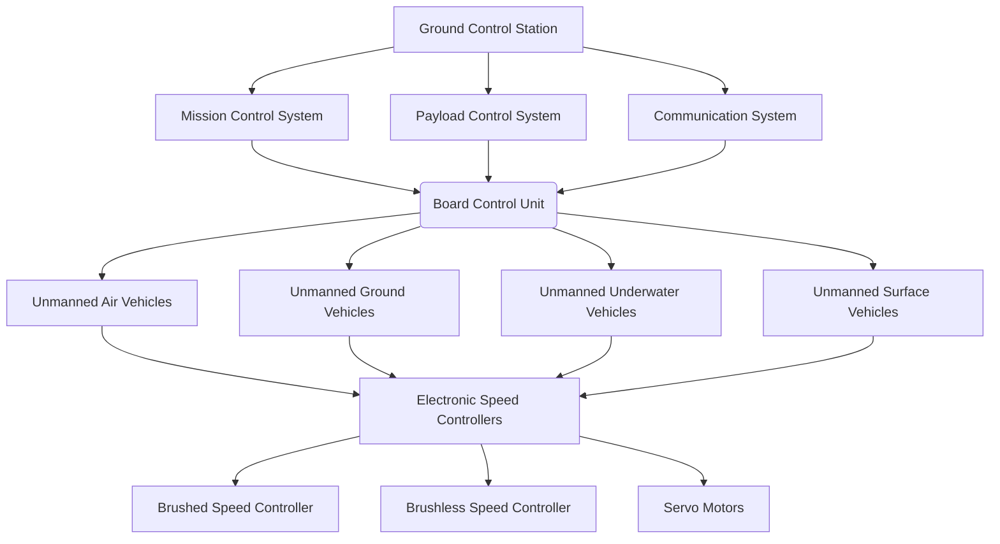
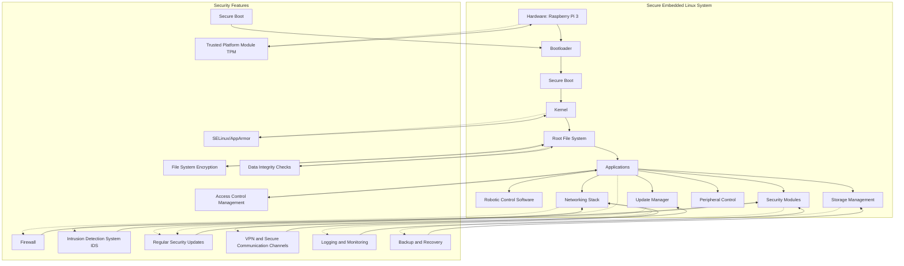
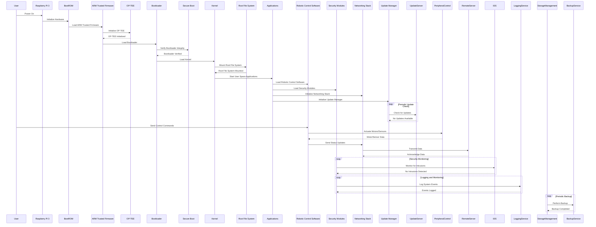

high-level architecture diagram for a secure embedded Linux system running on a Raspberry Pi 3 for a robotic/rover/unmanned.

```mermaid
graph TD
    subgraph "Secure Embedded Linux System"
        A[Hardware: Raspberry Pi 3] --> B[Bootloader]
        B --> C[Secure Boot]
        C --> D[Kernel]
        D --> E[Root File System]
        E --> F[Applications]
        F --> G[Robotic Control Software]
        F --> H[Security Modules]
        F --> I[Networking Stack]
    end

    subgraph "Security Features"
        J[Secure Boot]
        J --> B
        K[Trusted Platform Module (TPM)]
        K --> A
        L[File System Encryption]
        L --> E
        M[SELinux/AppArmor]
        M --> D
        N[Firewall]
        N --> I
        O[Intrusion Detection System (IDS)]
        O --> H
        P[Regular Security Updates]
        P --> F
    end

    A -.-> K
    D -.-> M
    E -.-> L
    I -.-> N
    H -.-> O
    F -.-> P
```

### Explanation:
1. **Hardware: Raspberry Pi 3**: The physical device.
2. **Bootloader**: Initializes hardware and loads the kernel.
3. **Secure Boot**: Ensures that only authenticated and authorized code is executed during boot.
4. **Kernel**: The core of the operating system.
5. **Root File System**: Contains the operating system files.
6. **Applications**: User-space applications running on the system.
7. **Robotic Control Software**: Specific applications to control the robotic/rover/unmanned system.
8. **Security Modules**: Additional security software like intrusion detection.
9. **Networking Stack**: Manages network communications.

### Security Features:
1. **Secure Boot**: Integrated with the bootloader to ensure integrity.
2. **Trusted Platform Module (TPM)**: Provides hardware-based security functions.
3. **File System Encryption**: Protects data at rest.
4. **SELinux/AppArmor**: Mandatory access control to enforce security policies.
5. **Firewall**: Controls incoming and outgoing network traffic.
6. **Intrusion Detection System (IDS)**: Monitors for suspicious activities.
7. **Regular Security Updates**: Keeps the system secure against vulnerabilities.

This architecture ensures a robust and secure system for your robotic/rover/unmanned application.


Certainly! Let's expand the diagram to include more comprehensive security features and detailed components of the robotic/rover/unmanned system. Here is the updated high-level architecture diagram using Mermaid syntax:

```mermaid
graph TD
    subgraph "Secure Embedded Linux System"
        A[Hardware: Raspberry Pi 3] --> B[Bootloader]
        B --> C[Secure Boot]
        C --> D[Kernel]
        D --> E[Root File System]
        E --> F[Applications]
        F --> G[Robotic Control Software]
        F --> H[Security Modules]
        F --> I[Networking Stack]
        F --> Q[Storage Management]
        F --> R[Peripheral Control]
    end

    subgraph "Security Features"
        J[Secure Boot]
        J --> B
        K[Trusted Platform Module (TPM)]
        K --> A
        L[File System Encryption]
        L --> E
        M[SELinux/AppArmor]
        M --> D
        N[Firewall]
        N --> I
        O[Intrusion Detection System (IDS)]
        O --> H
        P[Regular Security Updates]
        P --> F
        S[VPN and Secure Communication Channels]
        S --> I
        T[Access Control Management]
        T --> F
        U[Logging and Monitoring]
        U --> H
        V[Backup and Recovery]
        V --> Q
        W[Data Integrity Checks]
        W --> E
    end

    A -.-> K
    D -.-> M
    E -.-> L
    E -.-> W
    I -.-> N
    I -.-> S
    H -.-> O
    H -.-> U
    F -.-> P
    F -.-> T
    Q -.-> V
```

### Additional Components:
1. **Storage Management**: Handles data storage and retrieval.
2. **Peripheral Control**: Manages communication with sensors, actuators, and other peripherals.

### Additional Security Features:
1. **VPN and Secure Communication Channels**: Ensures secure data transmission over networks.
2. **Access Control Management**: Manages user permissions and access rights.
3. **Logging and Monitoring**: Keeps track of system activities and potential security events.
4. **Backup and Recovery**: Provides mechanisms for data backup and system recovery.
5. **Data Integrity Checks**: Ensures the integrity of the data stored on the system.

This expanded architecture provides a more comprehensive overview of the components and security features necessary for a secure embedded Linux system running on a Raspberry Pi 3 for a robotic/rover/unmanned application.


You're right. To ensure the embedded Linux system on the Raspberry Pi 3 is secure, it is crucial to handle various update mechanisms effectively. Let's update the high-level architecture diagram to include software updates and patch management.



### Additional Component:
1. **Update Manager**: Manages software updates and patch management for the system.

### Security Features:
1. **Regular Security Updates**: Ensures that the system receives timely updates to address vulnerabilities. This is now handled by the Update Manager, which is responsible for applying updates securely.

### Explanation:
- The **Update Manager** is responsible for managing and applying software updates, including security patches. This ensures that the system remains up-to-date with the latest security fixes.
- **Regular Security Updates** are applied by the Update Manager to ensure that any vulnerabilities in the system are addressed promptly.

This expanded architecture ensures that the system not only starts securely and operates securely but also remains secure over time through regular updates and patch management.
====================================================================================================================================================================================================

Thank you for pointing that out. Let's enhance the sequence diagram to include the usage of OP-TEE (Open Portable Trusted Execution Environment) and ARM Trusted Firmware. These components are crucial for building a secure embedded Linux system on the Raspberry Pi 3.

### Enhanced Sequence Diagram



### Explanation:
1. **User Power On**: The user powers on the Raspberry Pi 3.
2. **BootROM Initialization**: The BootROM initializes the hardware.
3. **ARM Trusted Firmware Loading**: The BootROM loads the ARM Trusted Firmware.
4. **OP-TEE Initialization**: The ARM Trusted Firmware initializes the OP-TEE.
5. **Bootloader Loading**: The ARM Trusted Firmware loads the bootloader.
6. **Secure Boot Verification**: The secure boot process verifies the integrity of the bootloader.
7. **Kernel Loading**: The bootloader loads the kernel.
8. **Root File System Mounting**: The kernel mounts the root file system.
9. **Application Initialization**: User-space applications, including robotic control software, security modules, networking stack, and update manager, are started.
10. **Periodic Update Check**: The update manager periodically checks for software updates.
11. **Control Commands**: The user sends control commands to the robotic control software.
12. **Peripheral Control**: The robotic control software actuates motors and sensors and receives data.
13. **Network Communication**: The robotic control software sends status updates through the networking stack to a remote server.
14. **Security Monitoring**: Security modules monitor for intrusions.
15. **Logging and Monitoring**: Security modules log system events.
16. **Periodic Backup**: Storage management performs periodic backups.

This enhanced sequence diagram now includes the initialization of OP-TEE and ARM Trusted Firmware, reflecting a more secure boot process and Trusted Execution Environment for the Raspberry Pi 3.